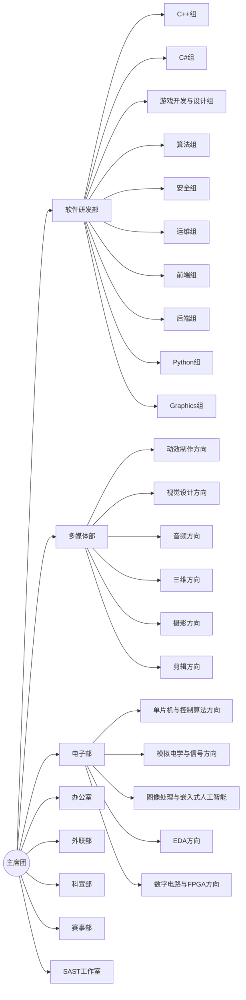

# 部门介绍

## 各部门信息

> ⬅️ 向左滑动下表 查看部门招新群 ⬅️

| 部门 | 介绍文档链接 |
|------|-------------|
| **软件研发部** | [https://njupt-sast.feishu.cn/sync/MBtwdc0QtszzmLb6MqBcV1Ssnwb](https://njupt-sast.feishu.cn/sync/MBtwdc0QtszzmLb6MqBcV1Ssnwb) |
| **多媒体部** | [https://njupt-sast.feishu.cn/sync/T5PIdGycUs7kAvbN1k5cG7fvnVg](https://njupt-sast.feishu.cn/sync/T5PIdGycUs7kAvbN1k5cG7fvnVg) |
| **电子部** | [https://njupt-sast.feishu.cn/sync/S6igdbWA0srp3wbaKYjc1DiZnkd](https://njupt-sast.feishu.cn/sync/S6igdbWA0srp3wbaKYjc1DiZnkd) |

---

## 部门架构

技术部门下面还会进一步细分为各个组/方向。

>加入校科协后，满足一定条件，在大二结束后可以选择留任成为 SAST 工作室的一员，SAST 工作室仅支持通过此方式加入。
